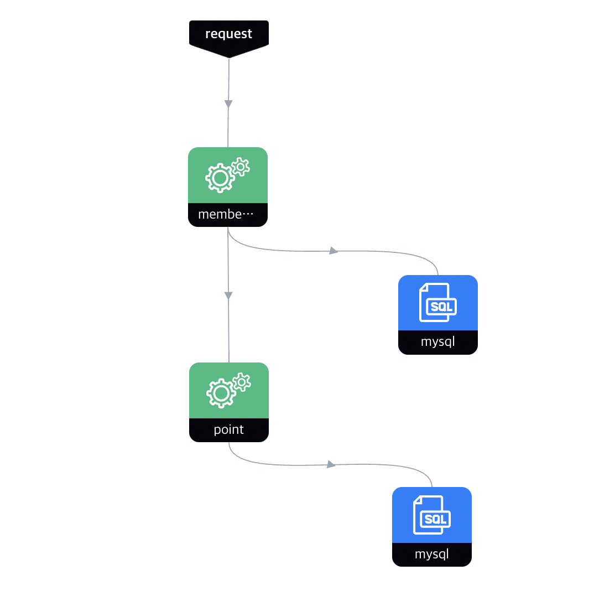
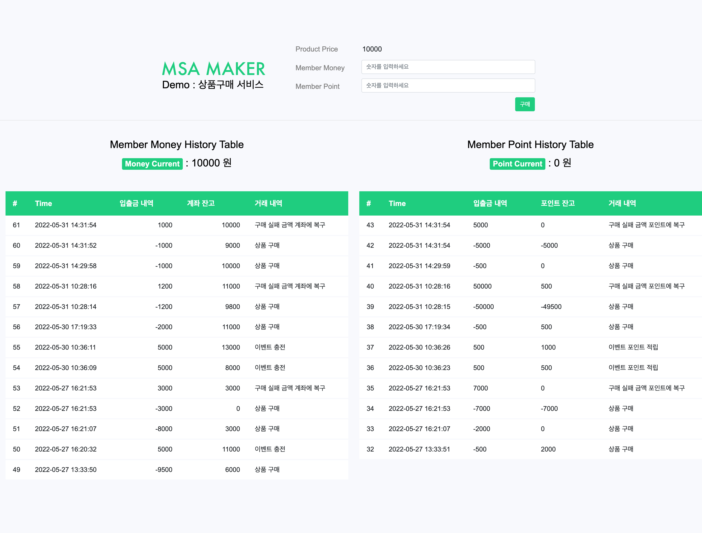

# msa-maker-demo 예시 프로젝트 : 상품 구매 서비스
MSA Maker를 이용해 서비스간 Transaction을 연결하여 쉽게 Routing Rule을 설계할 수 있습니다.

설계한 Routing Rule을 구성한 서비스는 템플릿으로 제공받을 수 있으며, 본 프로젝트는 MSA Maker에서 내려받은 템플릿을 사용해서 개발을 진행하였습니다.

MSA Maker이 제공한 템플릿 프로젝트는 설계된 룰에 포함된 마이크로 서비스 간의 통신을 미리 설정해두었기 때문에, 개발자들은 트랜잭션에 대한 걱정없이 비즈니스 로직에만 온전히 집중할 수 있습니다.

<br>

## 목적
- 이 예시 프로젝트를 통해 MSA Maker 사용자가 템플릿으로 내려받은 프로젝트의 구성을 확인할 수 있도록 합니다.
- 라우팅의 정상 수행와 보상처리 수행에 대해 **개발자가 어떤 비즈니스 로직을 고려해야 하는지** 예시를 보여줍니다.

<br>

## Routing Rule
예시 프로젝트는 하단의 라우팅 룰을 기반으로 개발되어 있습니다.


<br>

## 시나리오 : 상품 구매 서비스
상품 구매 서비스의 시나리오는 다음과 같습니다.

### 시나리오 배경
- 상품을 구입하기 위해서는 상품 가격과 같은 금액을 지불해야 합니다.
- 고객은 계좌의 돈으로 금액을 지불할 수도, 포인트로 금액을 지불할 수도 있습니다.
- 계좌와 포인트 잔액은 0 이상의 숫자이어야 합니다.

### 시나리오
1. 고객은 상품 가격에 맞춰 **계좌와 포인트에서 각각 얼마를 지불하여 구매할지 결정**합니다.
2. 현재 **계좌**에 보유 중인 잔액으로 입력값을 **지불 가능한지 확인**합니다.
3. 현재 **포인트 계좌**에 보유 중인 잔액으로 입력값을 **지불 가능한지 확인**합니다.

### 시나리오 정상 수행
> 계좌와 포인트 계좌 잔액에서 입력값만큼 차감합니다.

### 시나리오 실패로 인한 보상처리 수행
> ⚠️ 둘 중 하나라도 금액이 부족하다면 상품 구매에 실패합니다. <br>
> 계좌와 포인트 계좌 잔액에서 입력값만큼 금액을 복구시킵니다.

<br>

## 실행

### 실행 조건
- 본 서비스에 라우팅 요청을 보내기 위해서는 MSA Maker가 설치된 환경이어야 합니다.
- MSA Maker 서비스와 통신하는 kafka 리소스를 바라봐야 합니다.
- 각 서비스는 MySQL 데이터베이스에 데이터를 저장합니다.

### 실행
- `backing-service` 경로로 이동하여 docker-compose 파일을 통해 간단히 리소스를 실행시킬 수 있습니다. <br> MySQL 데이터 베이스를 포함한 리소스를 실행합니다.
    ```shell
        docker-compose up
    ```
    Apple Silicon의 M1 모델에서 실행 테스트를 한다면 하단 명령어를 실행해 주세요.
    ```shell
        docker-compose -f docker-compose-for-m1.yml up
    ```
- local profile의 application.yaml을 기본 제공합니다.
- member, point 총 2개의 서비스를 실행합니다.
<br>

---

### 화면으로 프로젝트 확인


---

### Rest API 제공
PostMan에 import 가능한 json 파일을 제공합니다.
🖇️ [link](https://github.com/bespinglobal-cne/msa-sample/blob/main/file/msa-maker-sample.postman_collection.json)
